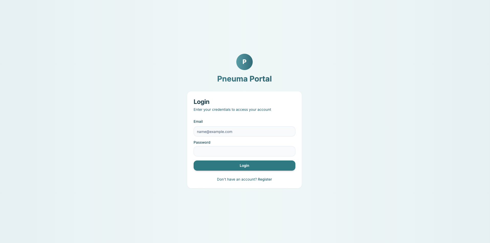
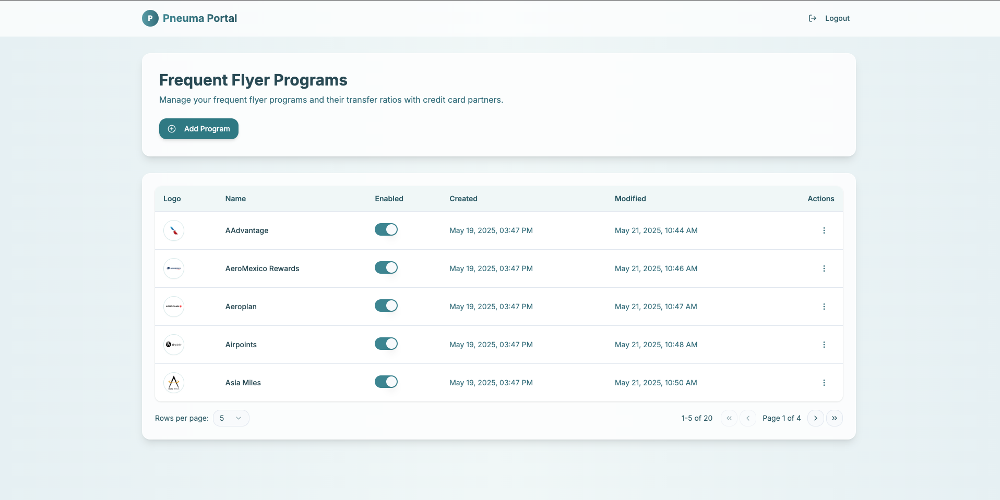
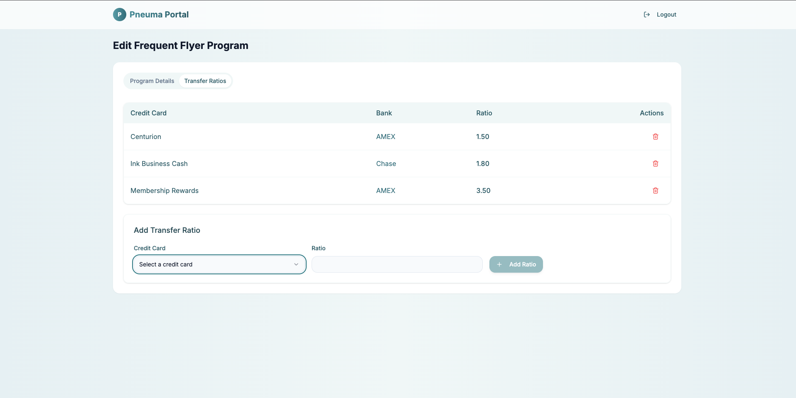

# ✈️  Pneuma FFP Transfer Management Portal

## Overview

This project is a full-stack web application developed as part of the Pneuma Senior Full-Stack Engineer challenge. The application enables administrators to manage Frequent Flyer Programs (FFPs), their associated credit card partners, and the transfer ratios between them.

## Features

* **Authentication**: Secure login system to protect the management portal.
* **FFP Management**:

  * List all FFPs with details like ID, name, logo, status (enabled/disabled), and timestamps.
  * Add new FFPs with associated details and logo upload.
  * Edit existing FFPs, including updating logos and statuses.
  * Delete (archive) FFPs as needed.
* **Transfer Ratios**:

  * Manage transfer ratios between FFPs and credit card partners.
  * Add, edit, or remove ratios with validation.
* **Responsive UI**: User-friendly interface built with Tailwind CSS.
* **Image Upload**: Integration with Cloudflare R2 for storing FFP logos.

## Tech Stack

* **Frontend**: Next.js, React, TypeScript, Tailwind CSS
* **Backend**: Next.js (API)
* **Database**: Postgresql (via Drizzle ORM) hosted on Neon
* **Storage**: Cloudflare R2 for logo assets
* **Deployment**: Vercel (Frontend & Backend)

## Getting Started

### Prerequisites

* Node.js (v14 or higher)
* pnpm
* Cloudflare R2 account and credentials([oraniumtech.com][1])

### Installation

1. **Clone the repository**:

   ```bash
   git clone https://github.com/sourabhR4ikwar/pneuma-portal.git
   cd pneuma-portal
   ```


2. **Install dependencies**:

   ```bash
   pnpm install
   ```


3. **Set up environment variables**:

   Create a `.env` file in the root directory and add the following:

   ```env
   DATABASE_URL="database_url_here"
   CLOUDFLARE_R2_ACCESS_KEY_ID="your_r2_access_key"
   CLOUDFLARE_R2_SECRET_ACCESS_KEY="your_r2_secret_key"
   CLOUDFLARE_R2_BUCKET_NAME="your_r2_bucket_name"
   CLOUDFLARE_R2_ENDPOINT="your_r2_endpoint"

   ```


4. **Run database migrations**:

   ```bash
   npx drizzle-kit generate
   npx drizzle-kit push
   ```


5. **Start the development server**:

   ```bash
   pnpm dev
   ```


The application will be available at `http://localhost:3000`.

## Usage

1. **Login**: Access the login page and authenticate using predefined credentials.
2. **Dashboard**: View the list of FFPs with options to add, edit, or delete entries.
3. **Add/Edit FFP**:

   * Click on "Add FFP" or the "Edit" button next to an existing FFP.
   * Fill in the required details, upload a logo, and manage transfer ratios.
   * Save changes to update the database.
4. **Delete FFP**: Use the "Delete" button to archive an FFP.

## Deployment

The application is deployed on Vercel and can be accessed at:

[https://pneuma-portal.vercel.app](https://pneuma-portal.vercel.app)

 
> - **Username**:  user@pneuma.club
> - **Password**:  password123

## Screenshots





